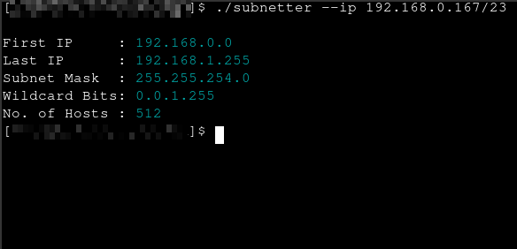

# Subnetter Tool
## Description :
This is a simple tool to find details about a network if you have the cidr and ip values. 

'subnetter.c' is the file with all the actual code.

The file has so much comments ,so you might not have trouble understanding the code 😅

I am also happy to hear from any of you about anything because I am new to post publicly on Github 😁
In fact I am looking forward to any feedback 

If you are using for the first time, try using the `--help` argument.

Also thank you for using or reading this program 😇 

## How to use : 
First clone this repo by typing `git clone https://github.com/Oliver-Proto/subnetter.git` on your terminal.

I don't have any makefiles or so. You will have to compile it with gcc or any compiler of your preference

I also have a gcc compiled executable in the 'compiled' folder if you wanna use that instead of compiling

On linux, use the follwing command in terminal to compile with gcc:

`gcc -o subnetter subnetter.c -lm`

**NOTE:** -lm flag must be used to link the math module as I use `pow()` in this program. 

## Example use:

